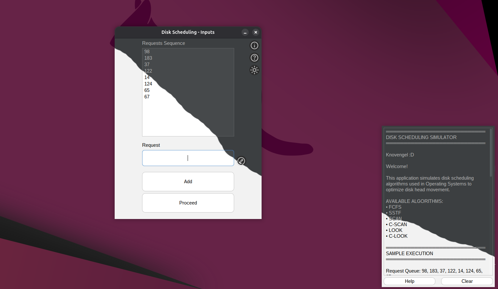
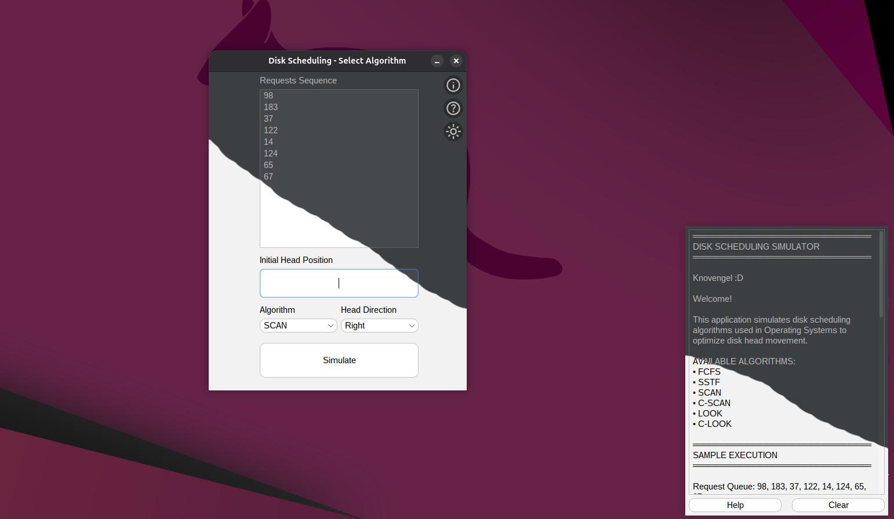
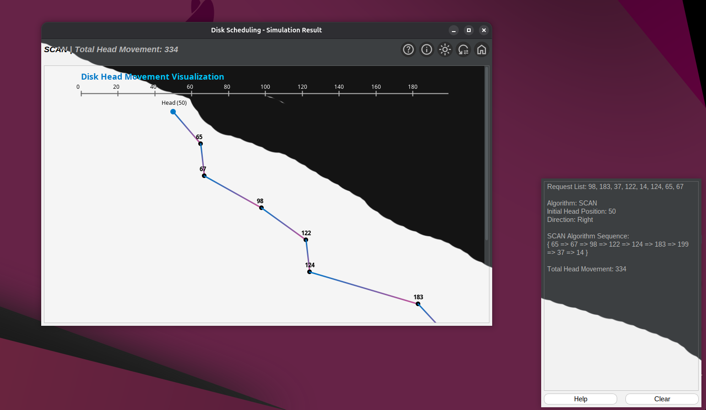

# Disk Scheduling Simulation

A Java-based Disk Scheduling Simulator that visualizes and compares different disk scheduling algorithms used in operating systems. This project helps understand how disk head movement is optimized to reduce seek time and improve performance.

---

## Overview

Disk scheduling is a key concept in operating systems that determines the order in which disk I/O requests are serviced. Efficient scheduling reduces seek time, which directly impacts system performance.

This simulator allows users to:
- Input custom disk request sequences
- Choose different scheduling algorithms
- Visualize disk head movement
- Compare total head movement across algorithms

---

## Features

- Implementation of core disk scheduling algorithms:
  - FCFS (First Come First Serve)
  - SSTF (Shortest Seek Time First)
  - SCAN (Elevator Algorithm)
  - C-SCAN (Circular SCAN)
  - LOOK
  - C-LOOK

- Graphical visualization of disk head movement
- Interactive terminal-style output panel
- Dark and Light theme support with smooth transitions
- Editable request queue (add, modify, autofill)
- Real-time calculation of total head movement
- Built-in help section explaining all algorithms

---

## Algorithms Implemented

- **FCFS (First Come First Serve)** – Processes requests in order of arrival  
- **SSTF (Shortest Seek Time First)** – Selects the nearest request  
- **SCAN (Elevator Algorithm)** – Moves in one direction servicing requests, then reverses  
- **C-SCAN (Circular SCAN)** – Services in one direction and jumps back  
- **LOOK** – SCAN but stops at the last request  
- **C-LOOK** – Circular version of LOOK  

---
## GUI Preview

<p align="center">
  
  <br>
  <em>Request Input (Dark vs Light Theme)</em>
</p>

<p align="center">
  
  <br>
  <em>Algorithm Selection and Input (Dark vs Light Theme)</em>
</p>

<p align="center">
  
  <br>
  <em>Disk Head Movement Visualization (Dark vs Light Theme)</em>
</p>

## How It Works

1. Enter disk request values  
2. Set the initial head position  
3. Select an algorithm and direction (if applicable)  
4. Run the simulation  
5. View:
   - Execution sequence  
   - Total head movement  
   - Graphical visualization  

---

## Running the Application

### Using an IDE (for development)
- Open the project in NetBeans / IntelliJ / Eclipse  
- Run `DiskScheduling.java`

### Using JAR (recommended for users)
```
java -jar DiskScheduling-1.0-SNAPSHOT.jar
```

---

## Requirements

- Java JDK 21 or higher  
- Any Java IDE (optional)

---

## Sample Output (SSTF)

```
Sequence -> 65 -> 67 -> 37 -> 14 -> 98 -> 122 -> 124 -> 183
Total Head Movement -> 205
```

---

## Project Structure

```
com.amasp.diskscheduling
│
├── Algorithm.java        // Scheduling logic
├── DiskScheduling.java  // Application entry point
├── Util.java            // UI utilities and theme handling
│
└── UI/
    ├── Input.java           // Request input screen
    ├── SecondInput.java     // Algorithm selection screen
    ├── MainFrame.java       // Visualization and results
    ├── DiskPanel.java       // Graph rendering
    ├── Terminal.java        // Output console
    └── Info.java            // About section
```

---

## Learning Outcomes

- Understanding disk scheduling algorithms  
- Visualizing head movement optimization  
- Comparing algorithm efficiency  
- Improving Java Swing GUI development skills  

---

## Technologies Used

- Java (Swing)
- FlatLaf (UI theming)
- Java2D (graphics rendering)

---

## Contributing

```
# Fork the repository
# Create a new branch
git checkout -b feature-name

# Commit changes
git commit -m "Add feature"

# Push changes
git push origin feature-name
```

Then open a Pull Request.

---

## Author

Aryan Anand Patil  
GitHub: https://github.com/Knovengel-Nova  
Email: knovengel@gmail.com  

---

## Support

If you found this project useful, consider giving it a star on GitHub.
